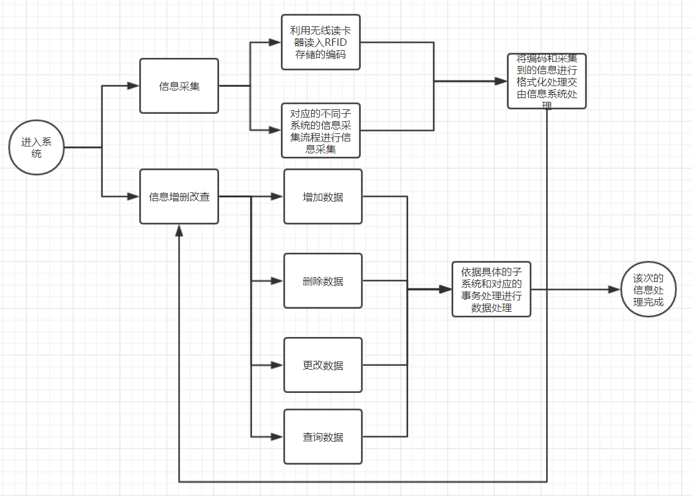
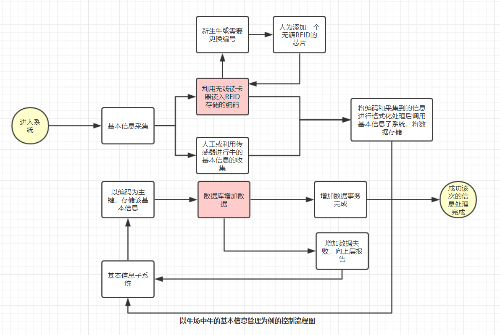

基于RFID牛场养殖信息管理系统

# 系统介绍

本系统利用无源RFID标签对牛场中的每头牛进行编号管理，使得每一头牛拥有一个独一无二的编号，即身份码，以实现对于每头牛精确的管理，信息采集、存储和处理的任务。

# 系统架构

系统分为两个方面：硬件方面与软件处理方面，也可以看作信息的采集和信息存储等处理两个模块。

牛场对每一头牛在起出生是分配一个无源RFID标签，并放置于牛的身体上，如为每一头牛的左耳穿孔，挂上一个芯片即可。根据EPC编码,我们可以实现足够多的编码来为牛场的每一头牛设置一个编码。

在系统的每一个子系统进行信息的采集时，可以分批的、单一的对每一头牛进行信息采集，然后利用设当的读卡器进行读取当前采集信息的牛的RFID所存储的编码，以此作为编码依据将物理信息存储到远程集中的设备中（如针对此设计的数据库等）。

因为对一头牛都有一个唯一的编码，所以一切针对单一个体的信息采集的行为都可以实现，如牛的每一天的身体健康检查数据、牛的活动信息、牛的进食信息、牛的某一物资的产量等等。

大致的一个系统架构图如下： 

# 控制流程图

作为一个信息管理系统，关键是对所研究物体的某些感兴趣信息的采集和格式化处理后存放以及对数据的分类利用，以实现挖掘所承载的信息来研究其内在行为。所以一个基于RFID的牛场养殖信息管理系统的主要侧重点是信息的采集。对于不同方面的信息的采集虽然细节因为所关注的不同方面而不同（如采集基本信息的关注牛的形态、体重、身长、毛发等等，而不会像采集活动信息的关注牛在牛场中的活动范围、路线、停留时间等等），但是都可以抽象成为一个硬件（传感器、人等）向另一物体进行特定标准下的信息收集过程，而为了数据能真实的反映具体的每一个物体，如牛，就需要对其编号，如此处就是利用 无源RFID的编码的不重复性来为每一头牛进行编号，所以在具体的信息的采集完毕后（前），都需要一个对 无源RFID　读入识别过程。最后将不同的编号和对应搜集到的信息交由具体的信息管理系统的子系统就行处理即可。大致的控制流程图如下：

# 总结

向人类社会使用个人的居民身份证一样，对于一些工业、农业上的生产生活中，也需要对一批物品进行管理、唯一标识，并且要有一定的便捷性，故RFID作为一个简单、易用的成熟方案对于一个现代牛场的养殖的信息管理是一个基础，使用较小成本即可实现大批物品的编号管理，为建立系统提供数据上的基础。但是，RFID也有一定饿局限性，如标签在识别和传输中的加解密会有一定的出错，读取数据时的天线的选择以及RFID标签在物体上的固定性等等也是整个系统上的一些不能忽略的问题。物联网关键在于软硬件之间的链接，RFID作为一个人为为物品添加的附属物，可以更方便的实现物与网的无线的传输数据，体积小、成本低也是如今广泛使用的原因之一。