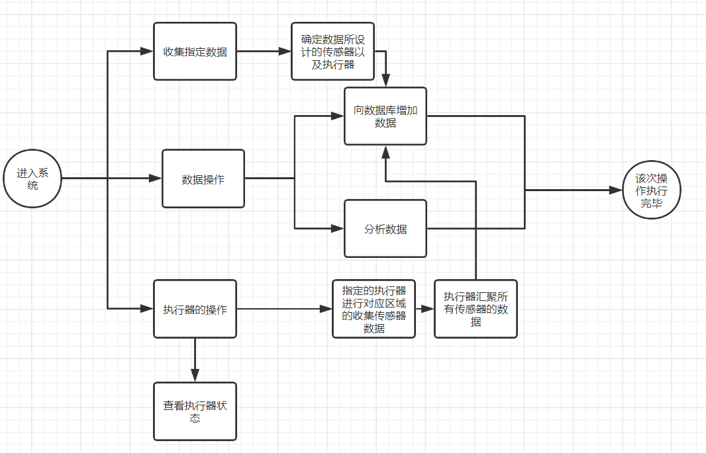
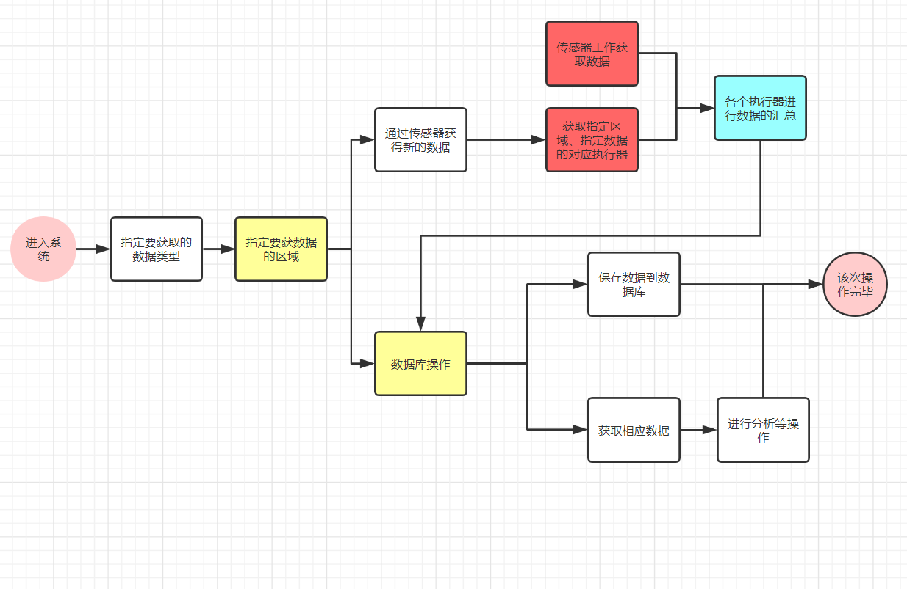

基于WSN的西瓜种植环境控制系统

# 系统介绍

根据西瓜种植产业的实际情况，考虑西瓜生长过程中的各种环境影响因素，如土壤的含水量、温度、水位、pH值，所处环境的含氧量、湿度、温度、光照等各种因素，针对性的铺设相应的传感器节点，并针对农场的具体的情况，分区域的布置执行器节点已收集数据，如此建立一个基于WSN的西瓜种植农场信息收集系统，最后布置相应的汇聚节点，收集整个系统中传感器的数据，发送到远程的控制中心，存储、识别利用收集的信息，针对性的对农场不同阶段种植情况进行评估、计划等操作。

# 系统架构

考虑到系统对数据的执行特点，整体上分为两个层面：数据处理的软件层面以及数据采集操作的硬件层面。对于软件层面，除针对性数据分析处理程序以及数据库管理系统外，还应有WSN的操作控制程序作为软硬件连接的一个桥梁。对于硬件层面，需要大量的传感器节点作为对农场中某一个具体地点的数据采集系统，如在整个农场的土壤中以一定间距进行铺设地下传感器，进行对西瓜生长土壤水分含量、水位、pH值等观察变量的检测，此外还可以铺设地上的传感器，用于检测光照、含氧量、温度、湿度等信息，每一个传感器检测自身周围的一部分区域，由点及面，实现对整个农场的检测。此外，还要对这些传感器节点进行针对性的分群，将点聚簇，并添加一定的可移动的、高效的进行对传感器采集到的数据进行回收的执行器节点，根据农场的大小，可以采用划区域顶点安置执行器节点、无人机绑定执行器节点、卫星搜集等形式实现，整个传感器硬件部分如同一个分布式服务器集群，通过大量的传感器节点尽可能的搜集到农场的所有地点的信息，并通过一定的执行器节点在所划定范围进行数据交换操作，大大减小系统的数据采集能力、容错能力。整个系统的系统架构图大致如下：

# 系统控制流程

利用物联网实现数据采集等功能的系统的大致的思想都是向传感器设定收集指定的数据、传感器进行收集数据、数据的汇聚存储、操作人员进行一定的分析等等的流程，如此一个大致的系统控制流程如下：

对于大多数数据的采集流程都是大同小异的，例如对于一次数据采集过程： ，种植场的管理人员先像系统发出获取数据任务，并指定要获取的数据的类型以及所涉及的区域，系统将记录数据的类型，对于已经存在的数据，显然可以直接从数据库中进行调取操作，之后返回管理人员进行相应的数据分析任务等等；如果要获取实时的数据，此时系统首先确定涉及的区域的所有执行器，然后通过网络等方式通知执行器，执行器将会在所设定的自身移动范围内采集所有的预先铺设的传感器收集对应数据，然后，执行器通过网络等设备将收集到的数据发送到上一层汇聚节点，汇聚节点再将数据交由具体的软件进行存储、处理等任务，此过程像一棵树，先由根节点发出指令，根节点对应的所有子节点将把任务交由其子节点完成，最后将完成的任务由叶子节点不断的向上层传递，完成一次数据采集任务。同样，各个传感器也可以接收到最上层的命令进行指定的任务。

# 总结

基于WSN所设计的控制系统主要分为两部分，执行器部分以及传感器部分，传感器仅完成具体的数据处理功能，而将所产生的数据之发送给最近的执行器部分，这样就可以实现由较少的执行器便可汇聚所有传感器的信息，是管理分层的同时更加高效的执行，增加系统的协同执行能力，因此这也是提升系统执行能力的因素之一。